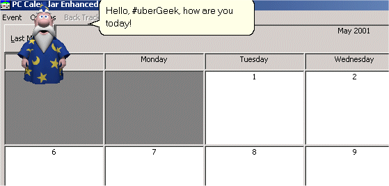



## UPDATED \- PC calendar enhanced

### Description

This code builds on the PC Calendar submitted by Johnathan Fullman

 

The new version includes:

 

-Microsoft Agent Intergration

 

-Streamlined Interface

 

-A few tweaks, and bug fixes

 

You can do a whole lot more with agent, then i've demonstrated in this app, and really add some cool functionality.

 Kudos to Johnathan for making a great calendar app.

 (Be sure to download the Microsoft agent components from http://msdn.microsoft.com/msagnet.

You'll need the agent runtime, the merlin character, and the text to speech engine. Most new computers come pre-installed with agent.)

 UPDATED!!! New version includes compelling new personalization features, usability improvements, tighter agent intergration, bug fixes, and some minor interface tweaks. Please leave any comments you have.
 
### More Info
 

             |
---                |---
**Submitted On**   |2001-05-19 07:15:10
**By**             |[\#uberGeek](https://github.com/Planet-Source-Code/PSCIndex/blob/master/ByAuthor/ubergeek.md)
**Level**          |Intermediate
**User Rating**    |4.1 (37 globes from 9 users)
**Compatibility**  |VB 6\.0
**Category**       |[Complete Applications](https://github.com/Planet-Source-Code/PSCIndex/blob/master/ByCategory/complete-applications__1-27.md)
**World**          |[Visual Basic](https://github.com/Planet-Source-Code/PSCIndex/blob/master/ByWorld/visual-basic.md)
**Archive File**   |[PC calenda197765192001\.zip](https://github.com/Planet-Source-Code/ubergeek-updated-pc-calendar-enhanced__1-23262/archive/master.zip)

